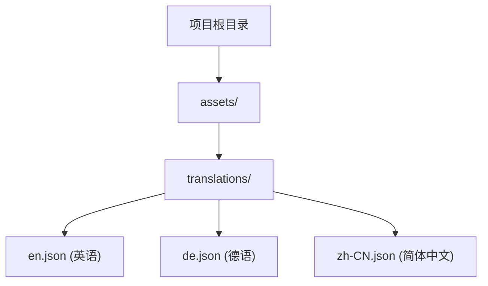

# 01 介绍与安装指南

本章节将介绍 `easy_localization` 的核心优势，并指导您完成基本的安装与项目结构设置。

## 为什么选择 easy_localization？

`easy_localization` 是 Flutter 生态中最受欢迎的国际化（i18n）解决方案之一。其主要优势包括：

- 🚀 **简单易用**：支持多种语言的快速切换。
- 🔌 **多格式支持**：支持 JSON、CSV、YAML、XML 等多种翻译文件格式。
- 💾 **自动持久化**：能够自动反应并保存用户的语言选择。
- ⚡ **功能全面**：内置对复数、性别、嵌套、RTL（从右向左）布局的支持。
- ↩️ **回退机制**：当某个 Key 缺失时，可自动回退到默认语言。
- 💻 **代码生成**：支持自动生成翻译 Key，提高代码质量。
- 🛡️ **空安全**：完全支持 Dart Null Safety。

## 安装步骤

### 1. 添加依赖

在项目的 `pubspec.yaml` 文件中添加以下依赖：

```yaml
dependencies:
  easy_localization: ^3.0.0 # 请使用最新版本
```

### 2. 创建翻译文件目录

默认情况下，建议在项目根目录下创建一个 `assets/translations` 文件夹。

```bash
assets
└── translations
    ├── en.json       # 仅语言代码
    └── en-US.json    # 或完整的语言-国家代码
```

### 3. 配置资源声明

确保在 `pubspec.yaml` 中声明了该资源目录：

```yaml
flutter:
  assets:
    - assets/translations/
```

## 资源文件结构可视化

以下图表展示了典型的多语言资源组织方式：



## 接下来

在完成基础安装后，我们需要在 Flutter 应用中进行配置。请参考 [02 配置与初始化详解](02-configuration-and-initialization.md)。
