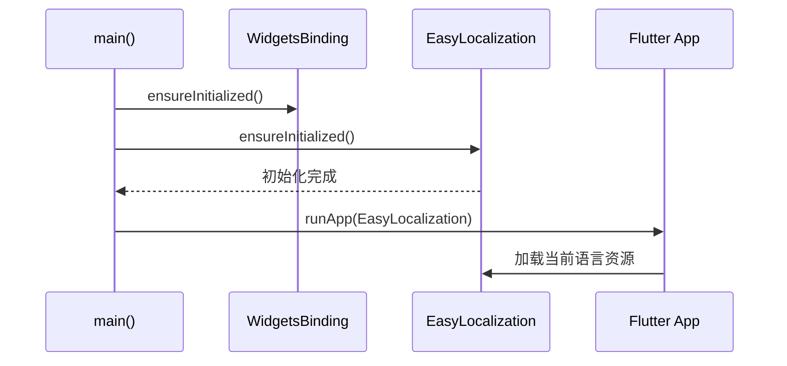

# 02 配置与初始化详解

在安装完依赖后，本章节将向您展示如何在 Flutter 应用中正确配置和初始化 `easy_localization`。

## iOS 平台的特殊处理

为了在 iOS 上正常工作，您需要在 `ios/Runner/Info.plist` 中添加支持的语言列表（`CFBundleLocalizations`）。

```xml
<key>CFBundleLocalizations</key>
<array>
 <string>en</string>
 <string>zh</string>
</array>
```

## 应用初始化

在 `main()` 函数中，您需要确保 `EasyLocalization` 已完成初始化。

### 示例代码

```dart
import 'package:flutter/material.dart';
import 'package:flutter_localizations/flutter_localizations.dart';
import 'package:easy_localization/easy_localization.dart';

void main() async {
  // 1. 必须先初始化 Widgets 绑定
  WidgetsFlutterBinding.ensureInitialized();
  
  // 2. 初始化 easy_localization
  await EasyLocalization.ensureInitialized();
  
  runApp(
    EasyLocalization(
      supportedLocales: [Locale('en', 'US'), Locale('zh', 'CN')],
      path: 'assets/translations', 
      fallbackLocale: Locale('en', 'US'),
      child: MyApp()
    ),
  );
}

class MyApp extends StatelessWidget {
  @override
  Widget build(BuildContext context) {
    return MaterialApp(
      // 3. 将本地化代理交给 MaterialApp
      localizationsDelegates: context.localizationDelegates,
      supportedLocales: context.supportedLocales,
      locale: context.locale,
      home: MyHomePage()
    );
  }
}
```

## 核心属性说明

| 属性 | 必填 | 默认值 | 描述 |
| :--- | :--- | :--- | :--- |
| `supportedLocales` | 是 | - | 支持的 Locale 列表 |
| `path` | 是 | - | 翻译资源文件所在的目录路径 |
| `fallbackLocale` | 否 | - | 当当前语言无法加载时使用的备用语言 |
| `saveLocale` | 否 | `true` | 是否将用户的语言选择保存到本地存储 |
| `useOnlyLangCode` | 否 | `false` | 是否仅使用语言代码查找文件（例如 `en.json` 而非 `en-US.json`） |

## 初始化流程图



## 接下来

完成配置后，您就可以在应用中随处使用翻译功能了。请参考 [03 基础用法与翻译技巧](03-basic-usage-and-translation.md)。
