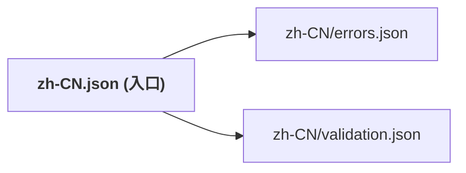

# 05 进阶：链接翻译与文件拆分

当项目规模扩大时，翻译文件可能会变得臃肿且难以维护。`easy_localization` 提供了“链接”功能来复用文本和拆分文件。

## 链接翻译 (Linked Translations)

如果您有一个翻译 Key 总是引用另一个 Key 的内容，可以使用 `@:` 前缀。

### 基本用法

```json
{
  "common": {
    "hello": "你好",
    "world": "世界"
  },
  "welcome": "@:common.hello @:common.world!"
}
```

```dart
print('welcome'.tr()); // 输出: 你好 世界!
```

### 格式化修饰符

您可以使用修饰符来控制被链接文本的大小写：

- `@.upper`: 全部大写
- `@.lower`: 全部小写
- `@.capitalize`: 首字母大写

```json
{
  "user": "用户",
  "error": "请填写您的 @.lower:user"
}
```

## 链接文件 (Linked Files)

为了保持 JSON 结构整洁，您可以将单个语言的翻译拆分到多个外部文件中。

### 定义链接

在主翻译文件中，使用 `:/` 前缀指定相对于资源目录的路径。

```json
// assets/translations/zh-CN.json
{
  "errors": ":/errors.json",
  "validation": ":/validation.json"
}
```

### 运行时文件结构

`easy_localization` 会自动加载对应的子文件：

```bash
assets
└── translations
    └── zh-CN
        ├── errors.json 
        └── validation.json  
```

> ⚠️ 注意：不要忘记在 `pubspec.yaml` 中包含这些新创建的文件夹或文件。

## 文件组织示意图



## 接下来

手动管理成百上千个翻译 Key 很容易出错。本库提供了强大的工具来自动生成这些 Key。请参考 [06 代码生成与强类型 Key](06-code-generation-and-keys.md)。
