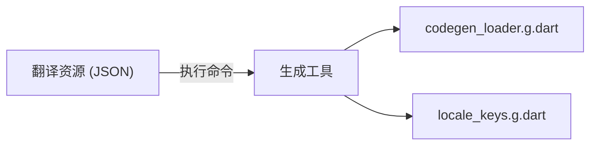

# 06 代码生成与强类型 Key

直接在代码中编写字符串 Key（如 `'title'.tr()`）容易因拼写错误导致翻译失效。`easy_localization` 提供了强大的命令行工具来解决这个问题。

## 为什么使用代码生成？

- **类型安全**：避免硬编码字符串带来的错误。
- **自动补全**：IDE 可以直接提示所有可用的翻译 Key。
- **高性能**：通过预加载资源减少运行时开销。

## 生成翻译加载类 (Asset Loader)

通过生成 `AssetLoader`，您可以将 JSON 数据编译进 Dart 代码中，从而避免运行时的文件 IO。

### 生成命令

```bash
flutter pub run easy_localization:generate
```

### 配置使用

```dart
import 'generated/codegen_loader.g.dart';

// ...
EasyLocalization(
  supportedLocales: [Locale('en', 'US'), Locale('zh', 'CN')],
  path: 'resources/langs',
  assetLoader: CodegenLoader(), // 使用生成的加载器
  child: MyApp()
)
```

## 生成翻译 Key 类 (Locale Keys)

生成一个包含所有翻译 Key 的类，以便在代码中以强类型方式引用。

### 生成命令

```bash
flutter pub run easy_localization:generate -f keys -o locale_keys.g.dart
```

### 代码调用

```dart
import 'generated/locale_keys.g.dart';

// 之前
Text('title').tr()

// 现在 (带自动补全)
Text(LocaleKeys.title).tr()
```

## 常用命令行参数

| 参数 | 短指令 | 默认值 | 描述 |
| :--- | :--- | :--- | :--- |
| `--source-dir` | `-S` | `resources/langs` | 资源文件所在目录 |
| `--output-dir` | `-O` | `lib/generated` | 生成文件的存放位置 |
| `--output-file` | `-o` | `codegen_loader.g.dart` | 生成的文件名 |
| `--format` | `-f` | `json` | 生成格式 (`json` 或 `keys`) |

## 生成流程示意图



## 接下来

在最后的章节中，我们将了解如何通过审计工具和日志系统来确保翻译的完整性。请参考 [07 审计工具、日志记录与扩展助手](07-audit-logger-and-helpers.md)。
