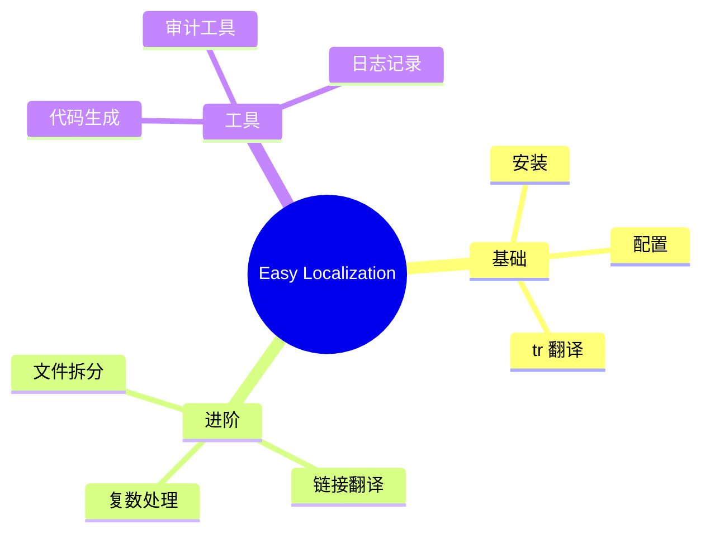

# 第 07 章：审计工具、日志记录与扩展助手

在本教程的最后一章，我们将探讨如何通过审计工具保证翻译完整性、如何自定义日志记录以及一些实用的扩展方法。

## 翻译审计 (Audit)

如果您没有使用代码生成，可能会不小心在代码中引用了不存在的 Key。`audit` 命令可以帮您找出这些缺失的 Key。

### 运行审计

```bash
flutter pub run easy_localization:audit
```

该命令会扫描您的 `lib` 目录和翻译资源目录，并输出不一致的地方。

## 日志系统 (Logger)

`easy_localization` 内置了灵活的日志系统，方便您调试翻译问题。

### 1. 仅显示缺失 Key 的警告

缺失 Key 通常被记录为警告（Warning）。您可以过滤掉其他信息：

```dart
EasyLocalization.logger.enableLevels = [
  LevelMessages.error, 
  LevelMessages.warning
];
```

### 2. 关闭日志

在生产环境下，您可能希望关闭所有日志：

```dart
EasyLocalization.logger.enableBuildModes = [];
```

### 3. 自定义日志打印

您可以接管日志输出，将其发送到您自己的日志服务：

```dart
EasyLocalization.logger.printer = (Object object, {String? name, StackTrace? stackTrace, LevelMessages? level}) {
  print('自定义日志[$name]: ${object.toString()}');
};
```

## 实用的扩展助手

### 字符串与 Locale 转换

```dart
// 字符串转 Locale
'zh_CN'.toLocale(); // 返回 Locale('zh', 'CN')

// 带分隔符的 Locale 转字符串
Locale('en', 'US').toStringWithSeparator(separator: '|') // 返回 "en|US"
```

### 重置与删除 Locale

```dart
// 重置为设备当前语言
context.resetLocale();

// 获取设备当前语言
print(context.deviceLocale.toString());

// 清除保存在本地的语言设置
context.deleteSaveLocale();
```

## 教程总结

恭喜您！您已经完成了 `easy_localization` 的全套教程。



通过这些功能，您可以轻松地为 Flutter 应用提供专业、稳健的多语言支持。如果您有更多疑问，请查阅 [官方 GitHub 仓库](https://github.com/aissat/easy_localization)。
